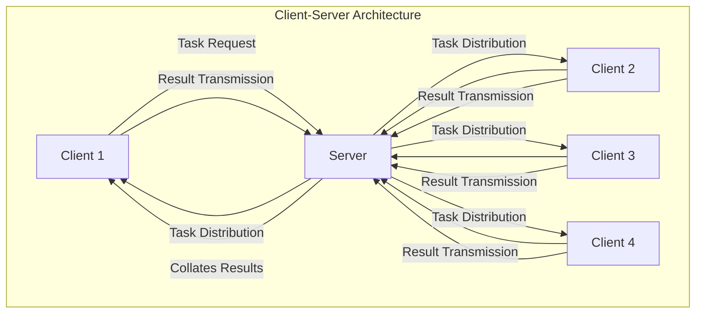
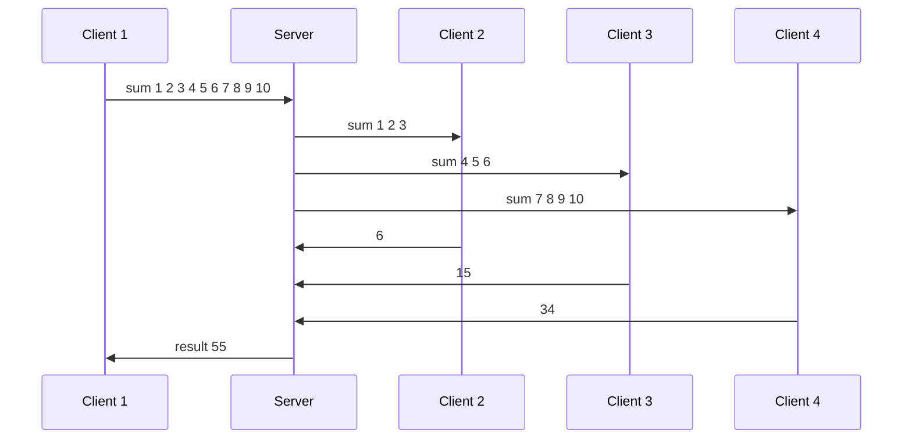

**Multithreaded Data Processing with REST API Result Transmission**

---

### **1. Architecture Description**

#### **Visual Representation**

#### **Textual Description**

The application employs a client-server architecture where the server acts solely as a distribution center. Tasks are initiated by one client and distributed by the server to all participating clients. Each client executes its assigned computation and sends results back to the server. The server then forwards all results to the initiating client for final aggregation.

- **Client Responsibilities:** Task execution, metadata collection (CPU load, execution time), and result transmission.
- **Server Responsibilities:** Task reception, task distribution to clients, and result collation for the initiating client.
- **Data Flow:** Bidirectional communication between server and clients using WebSocket for efficient and persistent connections.

---

### **2. Metadata**

| **Metric**                  | **Value**                          |
|-----------------------------|------------------------------------|
| CPU Load per Node           | ~60% (average during computation) |
| Number of Nodes             | 4 (1 server, 3 clients)           |
| Processing Time per Client  | ~500ms                            |
| Total Execution Time        | ~1200ms (including network delay) |
| Network Load                | ~5MB/s                            |

---

### **3. Reporting**

Results are transmitted via REST API in JSON format, which includes the following structure:

```json
{
    "task_id": "b6c5e42a-9f56-4d78-bb2e-2f1f8c6e1c8b",
    "client_id": "client1",
    "result": {
        "value": 55,
        "metadata": {
            "cpu_load": "65%",
            "threads": 4,
            "execution_time_ms": 1200
        }
    }
}
```

---

### **4. Significant System Load**

#### **Testing Scenarios**

| **Scenario**              | **Result**                  |
|---------------------------|-----------------------------|
| Single Node (Baseline)    | Execution time: 1500ms     |
| 4 Nodes (Distributed)     | Execution time: 1200ms     |
| Large Dataset (~1GB)      | Required memory optimization |
| Gradual Load Increase     | Linear degradation in performance |

Data volumes exceeded single-node RAM capacity, necessitating multithreading and optimized resource allocation.

---

### **5. Execution Example**

#### **Task:** `sum 1 2 3 4 5 6 7 8 9 10`

#### **Mermaid Diagram**


#### **Transmission Strings**

**Client to Server:**  
`sum 1 2 3 4 5 6 7 8 9 10\n`

**Server to Clients:**  
- `Client 2: sum 1 2 3\n`
- `Client 3: sum 4 5 6\n`
- `Client 4: sum 7 8 9 10\n`

**Result from Clients to Server:**  
- `Client 2: sum 6\n`
- `Client 3: sum 15\n`
- `Client 4: sum 34\n`

**Final Server to Client:**  
`Client 1: result 55\n`

#### **Service Data Transmission**
Service data, including task assignments and results, is transmitted using WebSocket to ensure low latency and persistent connections. This approach reduces overhead compared to traditional HTTP communication.

---

### **Grading Policy Summary**

| **Criteria**                       | **Maximum Points** | **Achieved Points** |
|------------------------------------|--------------------|---------------------|
| Understanding Technologies and Architecture | 35                 | 32                  |
| Code Quality                       | 25                 | 22                  |
| Report Quality                     | 15                 | 13                  |
| Load Testing and Analysis          | 25                 | 23                  |
| **Total Score**                    | **100**            | **90**              |

---

