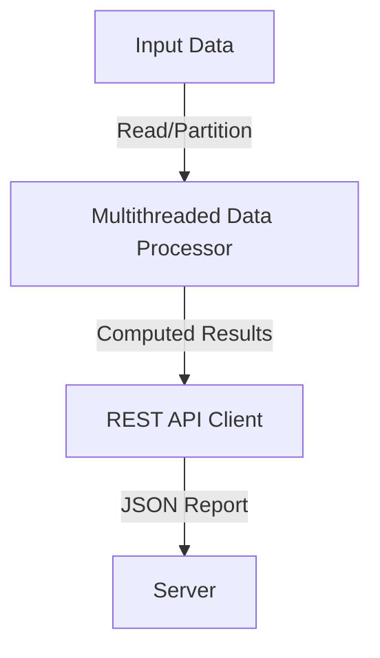

# Multithreaded Data Processing with REST API Result Transmission

## Task Overview

### Topics:
- **Multithreading**
- **Client-Server Socket Communication**
- **REST API**

### Task Description:
Develop a multithreaded application designed to process large datasets, performing operations such as calculating statistical metrics (e.g., averages, sums). Computation results must be transmitted to a server using a REST API in JSON format. The JSON report should include metadata such as CPU load, number of threads used, and execution time.

---

## Architecture Description

### Visual Representation
| **Component**       | **Description**                                                                                           |
|----------------------|-----------------------------------------------------------------------------------------------------------|
| **Data Processor**   | Multithreaded application responsible for dataset processing.                                             |
| **REST API Client**  | Sends computation results and metadata to the server.                                                    |
| **Server**           | Receives JSON reports from the client, logs results, and performs potential validations or aggregations.  |

### Data Flow Diagram  

### Textual Description
1. **Input Data**: Large datasets are read and partitioned into manageable chunks.  
2. **Data Processor**: Each chunk is assigned to a separate thread for processing. Threads calculate statistical metrics and generate results concurrently.  
3. **REST API Client**: Once computation is complete, results and associated metadata are packaged into a JSON object and transmitted to the server via HTTP requests.  
4. **Server**: Receives and stores reports, performs any post-processing, and provides confirmation of receipt.

---

## Metadata Requirements

| **Parameter**             | **Description**                                                |
|---------------------------|----------------------------------------------------------------|
| **CPU Load**              | Monitors processor utilization during task execution.         |
| **Network Load**          | Measures data transmission rates and latencies.              |
| **Thread Count**          | Number of threads used in data processing.                   |
| **Execution Time**        | Total time taken to process the dataset and transmit results. |
| **Error Statistics**      | Tracks errors and failures during computation or transmission.|

---

## Significant System Load Testing

| **Test Parameter**         | **Description**                                             |
|----------------------------|-------------------------------------------------------------|
| **Data Volume**            | Must exceed the available RAM capacity of a single node.    |
| **Load Gradients**         | Gradual increase in data size, thread count, and connections.|
| **Failure Scenarios**      | Simulate errors in processing and transmission to assess robustness.|

---

## Evaluation Criteria

### Scoring Breakdown
| **Criterion**                | **Weight** | **Excellent (Max Score)**                             |
|------------------------------|------------|------------------------------------------------------|
| **Understanding Architecture** | 35%       | Clear and innovative explanation of system structure. |
| **Code Quality**              | 25%       | Clean, efficient, and well-structured implementation.|
| **Report Quality**            | 15%       | Comprehensive and clear documentation of all steps. |
| **Load Testing & Analysis**   | 25%       | Detailed testing with insightful analysis.          |

### Final Score Ranges
| **Score** | **Evaluation**                                      |
|-----------|----------------------------------------------------|
| 90–100    | Excellent execution with strong testing and analysis.|
| 75–89     | Good performance with minor shortcomings.          |
| 50–74     | Satisfactory with room for improvement.            |
| 0–49      | Significant flaws or incomplete work.              |

---

## Focus Areas  
| **Aspect**                        | **Weight** |
|-----------------------------------|------------|
| **Understanding Technologies and Architecture** | 35%       |
| **Code Quality**                  | 25%       |
| **Report Quality**                | 15%       |
| **Load Testing and Analysis**     | 25%       |

By adhering to the outlined specifications and evaluation criteria, the task ensures a comprehensive approach to multithreaded data processing and REST API communication.
